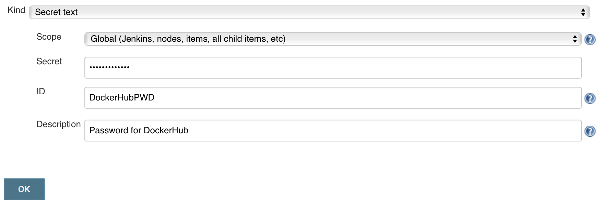

Group 8: Continues Delivery Setup Chain Documentation
==============================================================
## Link Minimal Viable Prototype
[Link to website](http://165.227.151.217:8080/)

## A Brief Description of the Continues Delivery Technology

#### Overview of the Setup

Our setup consists of the following components

- GitHub repository. Repository of the Web Application ( our Minimal Viable Prototype ) and where new changes to the application are being pushed.
- DockerHub repository. The repository where the docker image is being hosted. 
- Remote Machine on DigitalOcean with Jenkins Server. This server runs the build and delivery jobs. [Link to the server here](http://165.227.168.19:8080/login?from=%2F).
- The remote machine on DigitalOcean with the Static Web Server. Where the Web Application is being deployed and hosted.

#### Overview of the Build and Delivery Jobs
The Jenkins server is set up to check for changes in the GitHub repository.
If the Jenkins Server detects any changes in the GitHub repository it runs the build and deploys jobs.
The following is a description of the processes in each job:
##### The Build Job
The Jenkins Server builds a docker image from GitHub project repository. 
It then pushes the docker image up to the DockerHub repository.
##### The Deploy Job Process
The end of docker-build job then deploys the docker image that is hosted on the DockerHub to the Static Web Server. When this process is finished it logs onto the web server and initiate the setup image to start the server.

It then deploys the docker image that is hosted on the DockerHub to the Static Web Server. It logs in to When this process is finished it checks the status of the Web Application as a final step.


## Manual How to Setup The Continues Deliver and Integration Technology of Our Choice

- The pre recusite for this is that you have an account at Digital Ocean (https://www.digitalocean.com)
- Setup the public and private keys on your locale machine. [Guide here](https://www.digitalocean.com/community/tutorials/how-to-use-ssh-keys-with-digitalocean-droplets)
- Install Vagrant (https://www.vagrantup.com/docs/installation/) and VirtualBox (https://www.virtualbox.org/wiki/Downloads) to the remote machine
- Install Digital Ocean Vagrant plugin. [Guide here](vagrant up --provider=digital_ocean)

Further down there we will set up two remote machines on digital Ocean with Vagrant scripts.


The vagrant scripts will create two new Ubuntu 16.04.3 x64 droplets (smallest machines)


### Prepare The Remote Jenkins Server - Setup Jenkins


- Navigate to the Jenskins server directory in the project where the Vagrant file is contained.
- Put in your public SSH key in the Vagrant file.
- And what name you have given the SSH key on Digital Ocean
- Digital Ocean API key
```ruby
$script = <<SCRIPT
sudo apt-get update
sudo apt-key adv --keyserver hkp://p80.pool.sks-keyservers.net:80 --recv-keys 58118E89F3A912897C070ADBF76221572C52609D
echo "deb https://apt.dockerproject.org/repo ubuntu-xenial main" | sudo tee /etc/apt/sources.list.d/docker.list
sudo apt-get update
apt-cache policy docker-engine
sudo apt-get install -y docker-engine
sudo usermod -aG docker $(whoami)

curl --remote-name https://raw.githubusercontent.com/praqma-training/code-infra/jenkinsdocker/containers/jenkinsdocker/start.sh
chmod u+x ./start.sh
./start.sh
SCRIPT

Vagrant.configure(2) do |config|
  config.vm.box = 'digital_ocean'
  config.vm.box_url = "https://github.com/devopsgroup-io/vagrant-digitalocean/raw/master/box/digital_ocean.box"
  config.ssh.private_key_path = '~/.ssh/id_rsa'
  config.vm.synced_folder ".", "/vagrant", disabled: true

  config.vm.define "Jenkins Server", primary: true do |server|
  
  server.vm.provider :digital_ocean do |provider|
      provider.ssh_key_name = "[Insert SSH-key Name which was provided on the DigitalOcean Security site]"
      provider.token = '[insert Digital Oceans Token]'
      provider.image = 'ubuntu-16-04-x64'
      provider.region = 'fra1'
      provider.size = '512mb'
      provider.privatenetworking = true
  end
  
  
	server.vm.hostname = "JenkinsServer"
	server.vm.provision "shell", inline: <<-SHELL
		wget -q -O - https://pkg.jenkins.io/debian/jenkins-ci.org.key | sudo apt-key add -
		sudo sh -c 'echo deb http://pkg.jenkins.io/debian-stable binary/ > /etc/apt/sources.list.d/jenkins.list'
		sudo apt-get update
		sudo apt-get install -y jenkins
		sudo apt-get install -y openjdk-8-jdk

		sudo apt-get update
		sudo apt-key adv --keyserver hkp://p80.pool.sks-keyservers.net:80 --recv-keys 58118E89F3A912897C070ADBF76221572C52609D
		echo "deb https://apt.dockerproject.org/repo ubuntu-xenial main" | sudo tee /etc/apt/sources.list.d/docker.list
		sudo apt-get update
		apt-cache policy docker-engine
		sudo apt-get install -y docker-engine

		sudo usermod -aG docker $(whoami)
		sudo usermod -aG docker jenkins
		sudo systemctl daemon-reload
		sudo systemctl restart docker
		sudo service jenkins restart

		sudo chmod 700 ~/.ssh
		sudo echo "[Insert your public KEY here]"> ~/.ssh/authorized_keys
		sudo chmod 600 ~/.ssh/authorized_keys


		echo "********** Initial Admin Password **********"
		sudo cat /var/lib/jenkins/secrets/initialAdminPassword
		echo "********************************************"
	  
    SHELL
  end


end

end
```
- `vagrant up --provider=digital_ocean`
- After starting the Jenkins should be up and running. You can access it via [Jenkins server droplet IP]:8080. 


#### Configuring Jenkins
Access the Jenkins Server by going to [Jenkins server droplet IP]:8080.
Now that Jenkins is running you have to configure it. On the first time use it will present you the following page.


Here you have to insert the key that you get either from the output of the provision script or via:

`vagrant ssh`

`sudo cat /var/lib/jenkins/secrets/initialAdminPassword`

Subsequently, choose to Install suggested plugins.
Afterwards, create a first admin user on Jenkins. For this example, we will call it builder too.

##### Adding Credentials to Jenkins

To allow for the later use of DockerHub as the registry for the container with the final web application you need to be registered at https://hub.docker.com.
After you have created a user at DockerHub, in Jenkins navigate to Credentials -> (global) -> Add Credentials (which corresponds to navigating to the following URL: [Jenkins server IP]:8080/credentials/store/system/domain/_/ ).
There add a Secret text, where the secret is our password to our DockerHub account.



##### Creating Our Build Job

We are making a Freestyle build job in Jenkins.
- Name the job Build-Docker. 
- Under Source Code Magangement choose Git anf put in the GitHub repository.
- Under Build Trigger -> Select GitHub hook trigger for GITScm polling
		- Bear in mind that you will have to set up the trigger on GitHub. Go to Settings -> Integration & services and add Jenkins GitHub plugin.
- Under Build Environment -> Use secret text or files. Add under Secrete Text Variable DOCKERHUB_PWD.
- In Build - > Add Exectute Shell -> And put in this code:
```shell

cp -r /var/lib/jenkins/workspace/Build-Docker/ProjectFolders/WebApplication/Dockerfile ${WORKSPACE}
cp -r /var/lib/jenkins/workspace/Build-Docker/ProjectFolders/WebApplication/basic_http_server.go ${WORKSPACE}
docker build -t <YourDockerHubUserName>/<YourImageName>:${BUILD_NUMBER} .

set +x
docker login -u <YourDockerHubUserName> -p "${DOCKERHUB_PWD}"
set -x

docker push <YourDockerHubUserName>/<YourImageName>:${BUILD_NUMBER}
docker logout
end
```
- Add a second Ecxecute Shell with the following command:

```shell
 ssh -o "StrictHostKeyChecking no" root@<YourServerIP> ./deploy2.sh ${BUILD_NUMBER} <YourDockerHubUserName>

end
``` 
We will use it to execute shell commands to build and deploy our docker container.


### Prepare The Remote Static Web Server
- Navigate to the Static Web Application directory in the project where the Vagrant file is contained.
- Put in your public SSH key in the Vagrant file.
- And what name you have given the SSH key on Digital Ocean
- Digital Ocean API key
```ruby
Vagrant.configure("2") do |config|
  config.vm.box = 'digital_ocean'
  config.vm.box_url = "https://github.com/devopsgroup-io/vagrant-digitalocean/raw/master/box/digital_ocean.box"
  config.ssh.private_key_path = '~/.ssh/id_rsa'
  config.vm.synced_folder ".", "/vagrant", disabled: true
  #
  config.vm.define "HackerNewsWebApp", primary: true do |server|

    server.vm.provider :digital_ocean do |provider|
      provider.ssh_key_name = "[Insert SSH-key Name which was provided on the DigitalOcean Security site]"
      provider.token = '[insert Digital Oceans Token]'
      provider.image = 'ubuntu-16-04-x64'
      provider.region = 'fra1'
      provider.size = '512mb'
      provider.privatenetworking = true
    end

    server.vm.hostname = "HackerNewsWebApp"
    server.vm.provision "shell", inline: <<-SHELL
		
		sudo apt-get update
		sudo apt-key adv --keyserver hkp://p80.pool.sks-keyservers.net:80 --recv-keys 58118E89F3A912897C070ADBF76221572C52609D
		echo "deb https://apt.dockerproject.org/repo ubuntu-xenial main" | sudo tee /etc/apt/sources.list.d/docker.list
		sudo apt-get update
		apt-cache policy docker-engine
		sudo apt-get install -y docker-engine
		
		sudo chmod 700 ~/.ssh
		
		sudo echo "[Insert your public KEY here]"> ~/.ssh/authorized_keys		
		sudo chmod 600 ~/.ssh/authorized_keys
		wget https://raw.githubusercontent.com/DanielHauge/HackerNews-Grp8/master/ProjectFolders/WebApplication/deploy2.sh
		chmod u+x ./deploy2.sh
		
		
		
    SHELL
  end


end
```
- `vagrant up --provider=digital_ocean`
- After starting the Static Web Server should be up and running. You can access it via [Static Web Server IP]:8080. 
- Beware that if the deploy script isn't in the current repository, you'll need to change it to your github repository.
## We are Done!

That is it! After doing a commit to your designated github repository you should have the web application up and running on our remote machine. Try to point our browser to [Static Web Server IP]

This guide is base on The lecture notes [05-Continuous Integration and Delivery](https://github.com/datsoftlyngby/soft2017fall-lsd-teaching-material/blob/master/lecture_notes/05-Continuous%20Integration%20and%20Delivery.ipynb)
